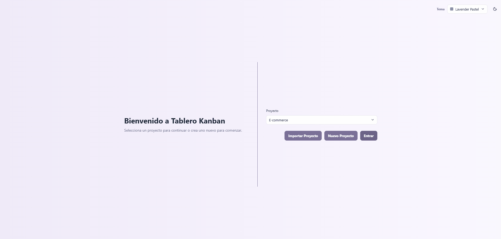
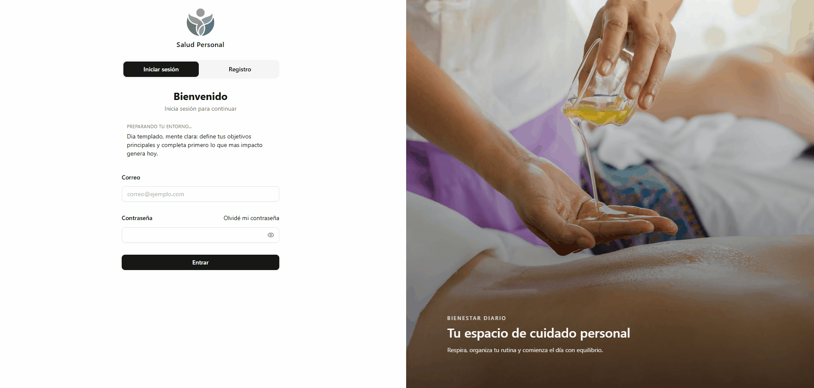

# 👋 Hola, soy Milton (megadato82)

Soy **Frontend Developer** con experiencia en **React, Vue, CSS3, Three.js y Canvas**, actualmente ampliando mis conocimientos en **Estrucutas y modelos agentes IA**.  
Me apasiona crear interfaces dinámicas, visualizaciones interactivas y experiencias de usuario fluidas, combinando diseño y funcionalidad.  

🎓 Estudiante de la Maestría en **Diseño de Interfaces Web** en la Universidad Internacional de La Rioja (España).  
💼 Desarrollador en **Liber Salus**, donde construyo recursos digitales para la salud en México.  

---

### 🚀 Tecnologías principales
- Frontend: React, Vue, Zustand, Recharts  
- Estilos y animaciones: CSS3, CanvasRenderingContext2D, Three.js  
- Backend en progreso: PHP, Symfony, MariaDB  
- Visualización: SVG dinámico, gráficos interactivos  

---

### 📌 Algunos de mis proyectos..

### 🗂️ Tablero Kanban
Aplicación en **React** con drag‑and‑drop y gestión visual de tareas.

### 🌐 Landing LiberSalus
Landing page responsiva en **Vue + CSS3**, optimizada para conversión y accesibilidad.

### 🎴 Tarjetas en React
Componente modular en **React** con estilos dinámicos y renderizado condicional.

### 🌍 Transición Planet
Animación 3D con **Three.js**, explorando transiciones y renderizado interactivo.

### 📊 EDR 2023
Dashboard interactivo con **SVG y CSS**, diseñado para visualización de datos.

### 🔐 Dash Salud Personal
Sistema de registro/login con **React + API**, enfocado en seguridad y usabilidad.

### 🩺 Monitoreo Salud
Visualización en **SVG y modelo 3D (Three.js)** para seguimiento de indicadores de salud.

